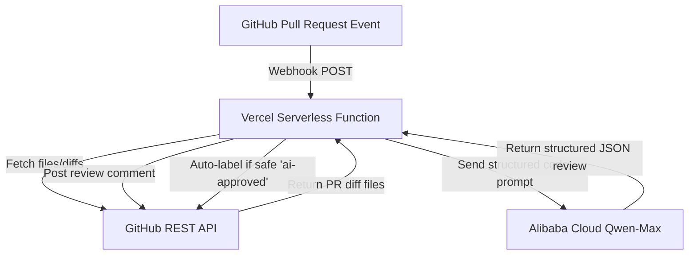

# CodeReview Autopilot 🤖

Automated code reviews powered by Alibaba Cloud's Qwen LLM and GitHub Webhooks, running serverless on Vercel.

## Track: Autopilot Agent

---

### Architecture

1. **GitHub Webhook** triggers the Vercel Serverless function when a PR is opened, synchronized, or reopened.
2. **Vercel Backend** fetches the PR code diff using GitHub API (Octokit).
3. **Qwen-Max** analyzes the code for bugs, security vulnerabilities, performance bottlenecks, and style.
4. **GitHub API** posts the structured review comment and auto-labels the PR.

---

### Proof of Alibaba Cloud Backend
The backend is hosted on Vercel (Serverless functions), but it makes API calls to Alibaba Cloud's Qwen service (`dashscope-intl.aliyuncs.com` compatible endpoint) to process the code analysis logic.

---

### How to Run

1. **Deploy Backend to Vercel**:
   - Create a new project in Vercel.
   - Set up the environment variables:
     - `QWEN_API_KEY`: Your Alibaba Cloud DashScope API Key (starts with `sk-...`).
     - `QWEN_BASE_URL`: (Optional) Your custom MaaS endpoint base URL if using a dedicated instance.
     - `GITHUB_TOKEN`: A Personal Access Token (Classic) with the `repo` scope.
2. **Set up Webhook**:
   - Go to your target GitHub repository's **Settings > Webhooks > Add webhook**.
   - **Payload URL**: `https://<your-vercel-domain>/api/review`
   - **Content type**: `application/json`
   - **Trigger events**: Select **Let me select individual events** and check **Pull requests**.
   - Save the webhook.
3. **Open a PR**:
   - Open a PR in your repository to see the review and label posted automatically!
